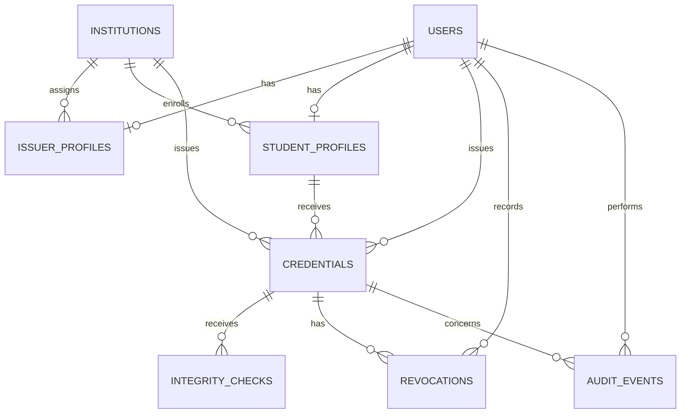
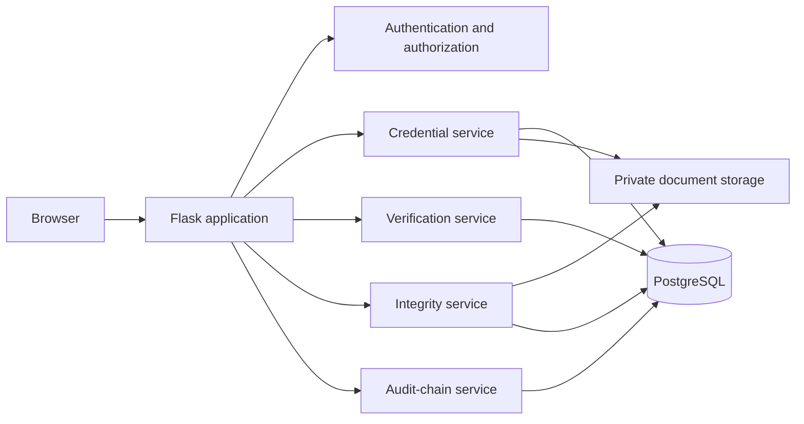

# Phase 0 Design: Academic Credential Vault

## Approved scope for the MVP

The MVP stores and verifies academic credential documents using SHA-256, PostgreSQL, private file storage, role-based access control, File Integrity Monitoring (FIM), and a tamper-evident internal audit ledger. It does **not** claim to be a decentralized blockchain application. Public-blockchain anchoring is deferred to advanced work.

Only PDF documents are accepted in the MVP. All demonstrations use generated dummy credentials and accounts.

## Roles and permission matrix

| Action | Administrator | Institution issuer | Student | Public verifier |
| --- | --- | --- | --- | --- |
| Manage users and issuer approvals | Yes | No | No | No |
| View system audit and integrity incidents | Yes | Institution-only reports | No | No |
| Issue a credential | No | Approved issuers, own institution only | No | No |
| Revoke or replace a credential | No | Credentials they issued, own institution only | No | No |
| View/download credential document | Administrative need only | Own institution scope | Own linked credentials | No |
| View public credential status | Yes | Yes | Yes | Yes |
| Upload a document for hash comparison | Yes | Yes | Yes | Yes |

An issuer is unusable until an administrator approves its issuer profile. Server-side checks, not navigation visibility, enforce every permission.

## Public verification privacy policy

The public verification response may contain:

- credential ID;
- institution name;
- credential title and programme;
- issue date;
- lifecycle status; and
- a masked student identifier (for example, `STU-20••42`).

It must not disclose the student email, full address, account data, document download URL, internal file key, complete SHA-256 baseline, audit metadata, or revocation reason unless a later privacy policy explicitly permits it.

## State definitions

### Credential lifecycle

| State | Meaning | Public result |
| --- | --- | --- |
| `active` | Issued and currently valid. | Authentic, subject to document comparison. |
| `revoked` | Invalidated by the issuer with a recorded reason. | Not valid. |
| `expired` | Past a configured expiry date. | Not valid. |
| `replaced` | Superseded by another credential. | Not valid; show replacement status only. |

### File integrity monitoring

| State | Meaning |
| --- | --- |
| `unchanged` | Stored file hash matches the issuance baseline. |
| `modified` | Stored file exists but its hash differs from the baseline. |
| `missing` | Storage key does not resolve to a file. |
| `inaccessible` | The file cannot be read due to an access or storage condition. |
| `error` | Any other unexpected check failure, recorded without sensitive data. |

## Core entity relationships

## Data-flow boundaries

## Threat model

| Threat | Risk | MVP mitigation |
| --- | --- | --- |
| Forged or altered credential | A verifier accepts a false document. | SHA-256 baseline, status checks, optional upload comparison, QR/ID lookup. |
| Malicious upload | Unsafe content, resource exhaustion, or filename attacks. | PDF-only allowlist, content checks, size limit, randomized private storage key, no user filename in paths. |
| Stolen account | Attacker issues, revokes, or downloads records. | Password hashing, password-strength rules, session security, rate limits, CSRF protection, audit events. |
| Cross-institution access | Issuer accesses another institution's credentials. | Institution ownership stored in records and checked on every protected action. |
| Unauthorized document access | Private documents become public URLs. | Store outside static files and authorize every download. |
| Database/audit tampering | An attacker changes history to hide activity. | Canonical hash-chained audit events, admin validation, backups, least-privilege database access. |
| Verification/login abuse | Brute force or denial of service degrades service. | Endpoint rate limits, upload size limits, safe validation, production deployment controls. |

## Deployment decision

Development uses Flask, PostgreSQL, a private local storage directory, and an APScheduler/manual integrity-check command. Production deployment is planned through Docker Compose with Gunicorn, PostgreSQL, and Nginx/HTTPS.

## Deferred decisions

- Blockchain testnet anchoring of daily audit roots.
- Email/SMS notifications.
- Object storage and managed encryption keys.
- Digital signatures by institutions.
